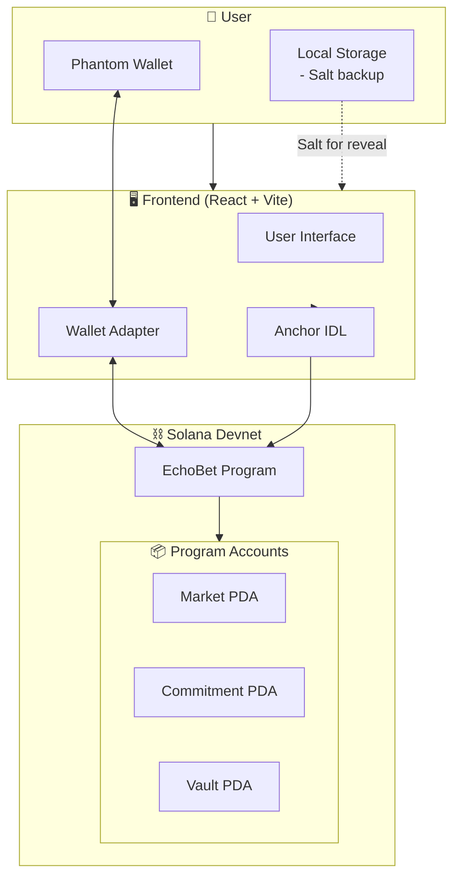
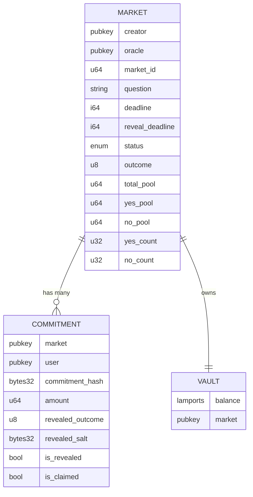
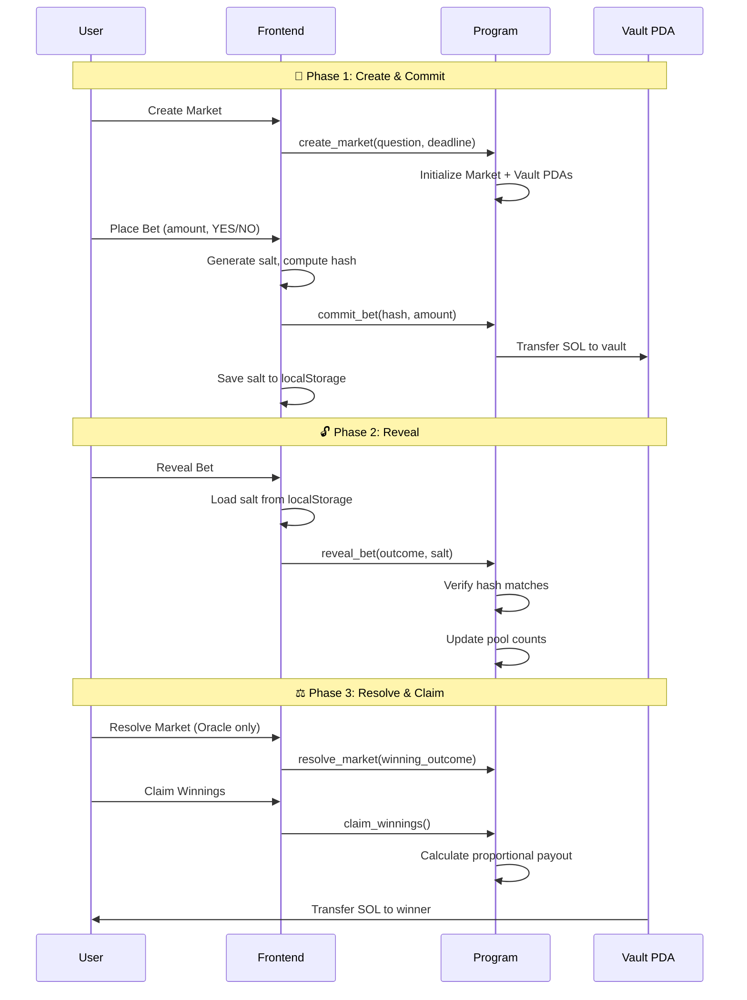

<p align="center">
  
  
  
  
</p>

<h1 align="center">🎲 EchoBet Pro</h1>

<p align="center">
  <strong>Privacy-Preserving Prediction Markets on Solana</strong>
</p>

<p align="center">
  <em>Bet privately. Reveal fairly. Win transparently.</em>
</p>

<p align="center">
  A decentralized prediction market that uses commit-reveal cryptography to prevent front-running and ensure fair betting — built for the <strong>Indie.fun Hackathon</strong>.
</p>

---

<p align="center">
  <a href="https://echobet-pro.vercel.app"><strong>🌐 Live Demo</strong></a> •
  <a href="https://explorer.solana.com/address/HTDC5bDN6u7q1FCYnEuevztZM1ZqKcD9ujPTTLwNfTCc?cluster=devnet"><strong>📜 On-Chain Program</strong></a> •
  <a href="#-quick-start"><strong>🚀 Quick Start</strong></a>
</p>

---

## ✨ Core Features

| Feature | Description |
|---------|-------------|
| 🔒 **Private Betting** | Bets are hidden using SHA-256 commitment hashes until reveal phase |
| ⚡ **Front-Running Protection** | Commit-reveal scheme prevents miners/validators from exploiting bet information |
| 💰 **Trustless Payouts** | Winnings are distributed proportionally from PDA-controlled vaults |
| 🎯 **Simple UX** | Clean interface for creating markets, placing bets, and claiming rewards |
| 📊 **Real-Time Dashboard** | Track all your bets, reveals, and winnings in one place |
| 🔐 **Non-Custodial** | Your funds stay in smart contract vaults — no central authority |

---

## 🔄 How It Works

EchoBet Pro uses a **three-phase commit-reveal mechanism** to ensure fair and private betting:

```
┌─────────────────────────────────────────────────────────────────────────────┐
│                           ECHOBET PRO FLOW                                  │
├─────────────────────────────────────────────────────────────────────────────┤
│                                                                             │
│   📝 PHASE 1: COMMIT          🔓 PHASE 2: REVEAL         🏆 PHASE 3: CLAIM │
│   ──────────────────          ──────────────────         ───────────────── │
│                                                                             │
│   User places bet with        After deadline,            Winners claim      │
│   hidden commitment:          user reveals:              proportional       │
│                                                          payouts:           │
│   hash(amount + outcome       • Original outcome                            │
│        + random_salt)         • Secret salt              payout = stake ×   │
│                               • Verified on-chain          (total_pool /    │
│   ↓                           ↓                              winning_pool)  │
│   Stored on-chain             Bet counted in pool        ↓                  │
│   (hidden from others)        (YES or NO)                SOL transferred    │
│                                                                             │
└─────────────────────────────────────────────────────────────────────────────┘
```

### Step-by-Step:

1. **🔐 Commit Phase** — Place your bet by submitting a hash of your choice + amount + secret salt. Nobody can see your bet.

2. **🔓 Reveal Phase** — After the betting deadline, reveal your original bet. The smart contract verifies your hash matches.

3. **🏆 Claim Phase** — Once the market is resolved, winners claim their proportional share from the prize pool.

---

## 🏗️ Architecture

### System Overview



### On-Chain Account Structure



### Instruction Flow



---

## 🛠️ Tech Stack

### Backend (Solana Program)
| Technology | Purpose |
|------------|---------|
| **Anchor 0.32.1** | Solana development framework |
| **Rust** | Smart contract language |
| **SHA-256** | Commitment hash generation |
| **PDAs** | Secure account derivation |

### Frontend
| Technology | Purpose |
|------------|---------|
| **React 18** | UI framework |
| **TypeScript** | Type safety |
| **Vite 7** | Build tool |
| **TailwindCSS** | Styling |
| **@solana/wallet-adapter** | Wallet integration |
| **@coral-xyz/anchor** | Program interaction |

### Infrastructure
| Service | Purpose |
|---------|---------|
| **Solana Devnet** | Blockchain network |
| **Vercel** | Frontend hosting |
| **GitHub** | Version control |

---

## 🔐 Security Highlights

| Security Feature | Implementation |
|------------------|----------------|
| **Commitment Scheme** | SHA-256 hash of (amount + outcome + 32-byte salt) |
| **Front-Running Prevention** | Bets hidden until reveal phase ends |
| **PDA Vaults** | Funds controlled by program, not individuals |
| **Time-Locked Phases** | Strict deadline enforcement on-chain |
| **Oracle Authorization** | Only designated resolver can set outcome |
| **Duplicate Prevention** | One commitment per user per market |
| **Overflow Protection** | Safe math on all pool calculations |

---

## 🚀 Quick Start

### Prerequisites

- Node.js 18+
- Rust & Cargo
- Solana CLI
- Anchor CLI 0.32.1

### Clone & Install

```bash
# Clone the repository
git clone https://github.com/TobieTom/echobet-pro.git
cd echobet-pro

# Install dependencies
npm install
cd app && npm install && cd ..
```

### Run Tests

```bash
# Start local validator and run tests
anchor test
```

### Local Development

```bash
# Terminal 1: Start local validator
solana-test-validator

# Terminal 2: Deploy program
anchor build
anchor deploy

# Terminal 3: Start frontend
cd app
npm run dev
```

Open [http://localhost:5173](http://localhost:5173) in your browser.

---

## 🌐 Devnet Deployment

| Resource | Value |
|----------|-------|
| **Program ID** | `HTDC5bDN6u7q1FCYnEuevztZM1ZqKcD9ujPTTLwNfTCc` |
| **Network** | Solana Devnet |
| **Live Demo** | [echobet-pro.vercel.app](https://echobet-pro.vercel.app) |
| **Explorer** | [View on Solana Explorer](https://explorer.solana.com/address/HTDC5bDN6u7q1FCYnEuevztZM1ZqKcD9ujPTTLwNfTCc?cluster=devnet) |

### Testing on Devnet

1. Install [Phantom Wallet](https://phantom.app/)
2. Switch to **Devnet** in Phantom settings
3. Get devnet SOL from [faucet.solana.com](https://faucet.solana.com)
4. Visit [echobet-pro.vercel.app](https://echobet-pro.vercel.app)
5. Connect wallet and start betting!

---

## 📁 Project Structure

```
echobet-pro/
├── programs/
│   └── echobet_pro/
│       └── src/
│           ├── lib.rs          # Main program logic
│           ├── state.rs        # Account structures
│           └── errors.rs       # Custom errors
├── app/
│   └── src/
│       ├── pages/
│       │   ├── Markets.tsx     # Market listing
│       │   ├── CreateMarket.tsx
│       │   ├── MarketDetail.tsx
│       │   └── Dashboard.tsx
│       ├── components/
│       ├── hooks/
│       │   ├── useProgram.ts   # Anchor integration
│       │   └── useBetStorage.ts
│       ├── utils/
│       │   ├── commitment.ts   # Hash generation
│       │   └── pda.ts          # PDA derivation
│       └── idl/
│           └── echobet_pro.json
├── tests/
│   └── echobet_pro.ts          # 23 comprehensive tests
├── Anchor.toml
└── README.md
```

---

## 🧪 Test Coverage

```
✓ Creates a market (409ms)
✓ Commits a bet (YES) (452ms)
✓ Commits a bet (NO) (443ms)
✓ Prevents duplicate commits (201ms)
✓ Reveals a bet correctly (389ms)
✓ Rejects invalid reveal (wrong salt) (198ms)
✓ Rejects invalid reveal (wrong outcome) (195ms)
✓ Resolves market as oracle (367ms)
✓ Rejects unauthorized resolver (189ms)
✓ Claims winnings for winner (412ms)
✓ Rejects claim for loser (187ms)
✓ Rejects double claim (184ms)
... and 11 more tests

23 passing (8.2s)
```

---

## 🎯 Future Roadmap

- [ ] **Mainnet Deployment** — Launch on Solana mainnet
- [ ] **Multiple Outcomes** — Support markets with 3+ options
- [ ] **Decentralized Oracles** — Integrate Pyth/Chainlink for resolution
- [ ] **Mobile App** — React Native companion app
- [ ] **Liquidity Pools** — AMM-style market making
- [ ] **Governance Token** — DAO for protocol decisions

---

## 👥 Team

Built by TobiasBond for the **Indie.fun Hackathon**

---

## 📄 License

This project is licensed under the MIT License - see the [LICENSE](LICENSE) file for details.

---

<p align="center">
  <strong>🎲 EchoBet Pro — Where Privacy Meets Prediction</strong>
</p>

<p align="center">
  <a href="https://echobet-pro.vercel.app">Try the Demo</a> •
  <a href="https://github.com/TobieTom/echobet-pro">View Source</a> •
  <a href="https://explorer.solana.com/address/HTDC5bDN6u7q1FCYnEuevztZM1ZqKcD9ujPTTLwNfTCc?cluster=devnet">Explore On-Chain</a>
</p>
